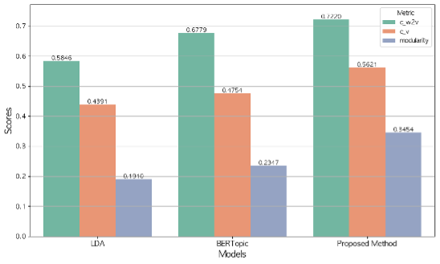

# Graph Neural Network-Based Topic Model Integrating Probabilistic and Embedding Information of Words

> 🎓 **Master's Thesis (Dec 2025)**
> - **Author:** Soonwoo Kim 
> - **Supervisor:** Prof. Suhyeon Kim
> - **Institution:** Department of Data Science, Kyungpook National University
> - **Link:** https://dcollection.knu.ac.kr/srch/srchDetail/000000111684


---

## Where this stemmed from
This project originated from a fundamental question: **can heterogeneous data of different natures be jointly leveraged?** Data constructed for a specific task inherently possess properties well-suited to addressing that task's objectives. This inquiry was further refined into a more concrete question $-$ whether such properties could be effectively exploited across heterogeneous data sources. Motivated by this curiosity, we represent these relationships as a graph structure and apply the proposed framework to topic modeling.

---

## Overview

This repository contains the full implementation of a novel topic modeling framework that integrates **LDA**, **BERTopic**, and a **Deep Modularity Networks (DMoN)** to overcome the limitations of each standalone model.

- LDA captures probabilistic co-occurrence structure but lacks semantic similarity.
- BERTopic captures contextual coherence but lacks interpretability of topic-word relations.
- Our method fuses probabilistic and embedding informations into a keyword graph and applies DMoN clustering to extract structurally and semantically coherent topics in an end-to-end manner.

---

## Methodology

### Stage 1 — Topic Model Output Extraction
- LDA produces a topic-word probability matrix (K words × T topics).
- BERTopic (via SBERT, `paraphrase-multilingual-mpnet-base-v2`) produces 384-dim word embeddings.

### Stage 2 — Keyword Graph Construction
| Edge Connections | Node Feature |
| :---: | :---: |
|  |  |

- **Strong edges**: Top-K keywords per LDA topic form dense intra-topic connections (edge weight = 1).
- **Weak edges**: Each non-core word connects to its most similar core word via cosine similarity (0 < weight < 1).

### Stage 3 — DMoN-based Clustering
- Node features = SBERT word embeddings (384-dim)
- A 3-layer GCN encoder performs message passing over the keyword graph.
- DMoN's modularity loss + collapse regularization identifies structurally stable topic clusters.


---

## Key Results

Evaluated on 1,015 Korean news articles (Jan 2023 – Feb 2025) from [BIG KINDS](https://www.bigkinds.or.kr), preprocessed to **2,597 keywords**.

| Model | C<sub>w2v</sub> | C<sub>v</sub> | Modularity |
|---|---|---|---|
| LDA | 0.5846 | 0.4391 | 0.1910 |
| BERTopic | 0.6779 | 0.4754 | 0.2347 |
| **Ours (DMoN)** | **0.7220** | **0.5621** | **0.3454** |
| **Improvement over LDA** | **+23.5%** | **+28.0%** | **+80.8%** |



---

<!-- ## Installation

```bash
git clone https://github.com/<your-username>/Topic-GNN-Integration.git
cd Topic-GNN-Integration
pip install -r requirements.txt -->
